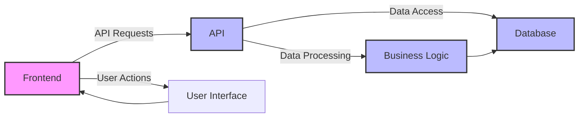

```mermaid

graph LR;
    A[Frontend] -->|API Requests| B[API];
    B -->|Data Access| C[Database];
    A -->|User Actions| D[User Interface];
    B -->|Data Processing| E[Business Logic];
    E --> C;
    D --> A;
    classDef frontend fill:#f9f,stroke:#333,stroke-width:2px;
    classDef backend fill:#bbf,stroke:#333,stroke-width:2px;
    class A frontend;
    class B,E backend;
    class C backend;
```