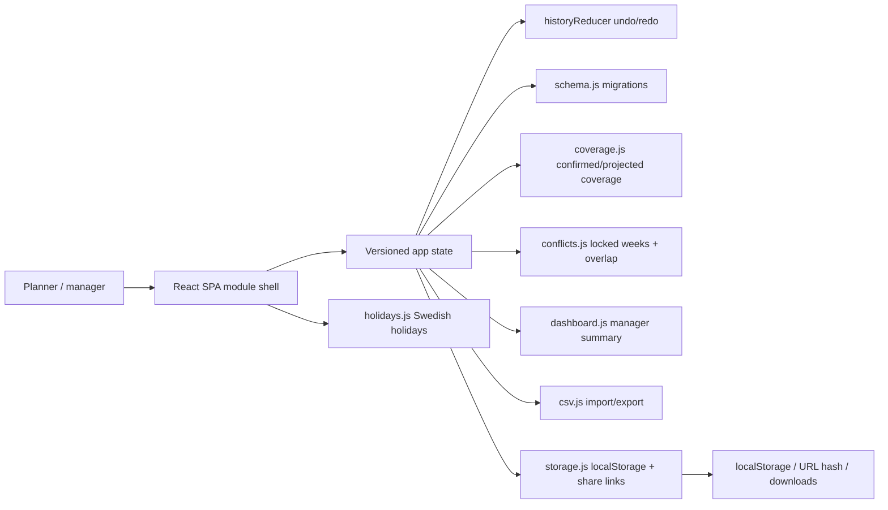

# Vacation Planner Architecture

## Current System

Vacation Planner is a client-only React/Vite single-page application. It has no backend, API server, authentication, or database. The app is structured so persistence can later move behind a REST/Supabase-style repository without rewriting UI modules.



## State Model

The active state shape is flat and serializable:

```js
{
  schemaVersion,
  operators,
  processes,
  vacationBlocks,
  demand,
  teams,
  settings
}
```

- `operators`: `{ id, name, shift, active, certifications[], teamId?, icon? }`
- `processes`: `{ id, name }[]`
- `vacationBlocks`: week ranges with status, optional day overrides, and notes.
- `demand`: keyed by process ID, then week number.
- `teams`: client-side team/group records for later grouping.
- `settings`: planning year, shift mode, visible/start week, staffing rules, overlap limit, locked weeks, holiday region, and color thresholds.

`src/schema.js` migrates legacy localStorage/share/import data from process names to process IDs and adds operator icon data.

## Modules

- `Dashboard`: read-only manager health summary with quick links back to Planning.
- `PlanningBoard`: current operator/week/day board, custom pointer drag, demand editing, coverage rows, and confirmed/projected toggle.
- `CertificationMatrix`: editable operators x processes competence grid plus process add/rename/remove.
- `Employees`: operator management using the existing operator panel conventions.
- `Settings`: planning and staffing controls.
- `ExportPrint`: printable vacation plan and projected coverage heatmap.

## Core Files

- `src/App.jsx`: state owner, module routing, undo/redo wiring, updater callbacks.
- `src/components/calendar/CalendarGrid.jsx`: custom pointer create/move/resize drag and week/day zoom.
- `src/components/calendar/WeekZoomGrid.jsx`: week board rows, vacation blocks, coverage, and demand.
- `src/components/calendar/DayZoomGrid.jsx`: day-level board and per-day status interactions.
- `src/components/calendar/CoverageRows.jsx`: coverage cells and tooltips.
- `src/components/OperatorPanel.jsx`: employee list, editing, CSV template, and name/certification search.
- `src/components/OperatorAvatar.jsx`: deterministic color/initial operator identity.
- `src/coverage.js`: pure coverage engine.
- `src/conflicts.js`: pure conflict/guardrail helpers.
- `src/dashboard.js`: pure dashboard summary.
- `src/storage.js`: browser persistence and share/import/export migration boundary.
- `src/store/`: async-capable local store abstraction.

## Data Flow

1. `App` loads shared state from the URL hash, then localStorage, then schema defaults.
2. Every loaded state passes through `migrateState`.
3. `historyReducer` wraps the migrated state for undo/redo.
4. Modules receive state plus narrow updater callbacks.
5. `coverage.js`, `conflicts.js`, and `dashboard.js` derive views from state.
6. `storage.js` debounces saves and migrates JSON/share-link data at boundaries.

## Verification

```bash
npm run test:ci
npm run lint
npm run build
graphify update .
```
