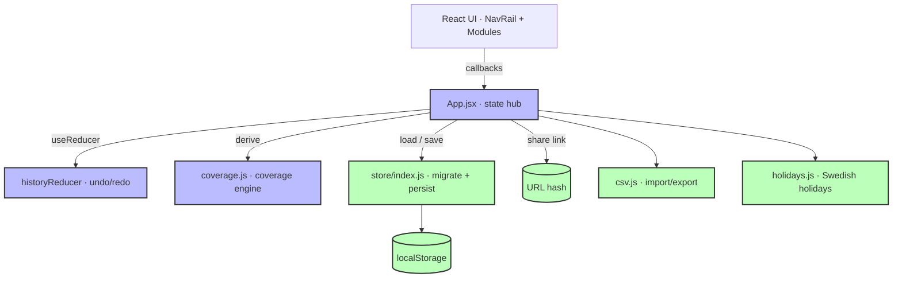

# Architecture

Vacation Planner is a **client-only single-page app** — a React + Vite frontend
with **no backend, no database, and no API**. All state lives in the browser
(localStorage) and can be shared via an encoded URL hash. Persistence is isolated
behind a small store seam (`src/store/`) so a real backend could be added later
without touching components.

## Modules
- **Planning board** — `components/calendar/CalendarGrid.jsx` (week + day zoom,
  custom pointer drag to create/move/resize leave, coverage rows, demand editor).
- **Certification matrix** — `modules/CertificationMatrix.jsx` (editable
  operators × processes grid; edits reflect live in coverage and the board).
- **Dashboard** — `modules/Dashboard.jsx` (manager health: red weeks, pending
  requests, who's off, biggest capacity gaps).
- **Employees** — `modules/Employees.jsx` (add/edit/search, CSV in/out).
- **Settings** — `modules/SettingsPanel.jsx` (planning window, staffing rules,
  locked weeks).
- **Export / Print** — `modules/ExportPrint.jsx` (printable coverage heatmap +
  leave schedule).

See `AGENTS.md` for the data model, commands, and conventions.
